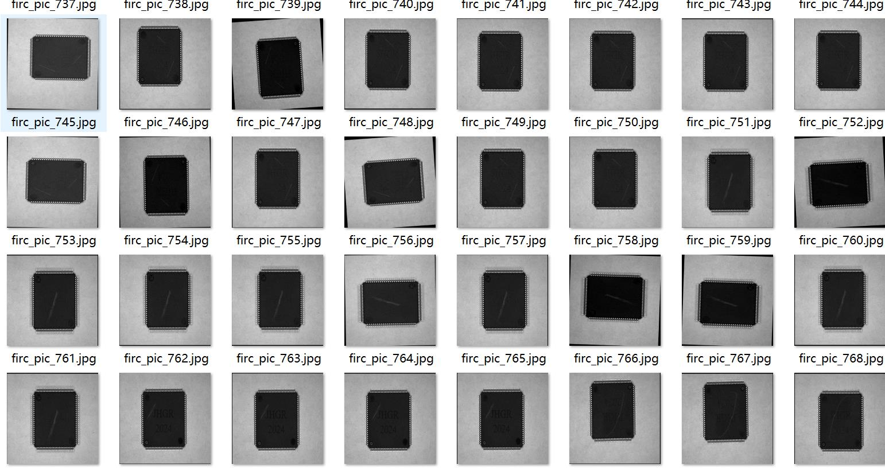
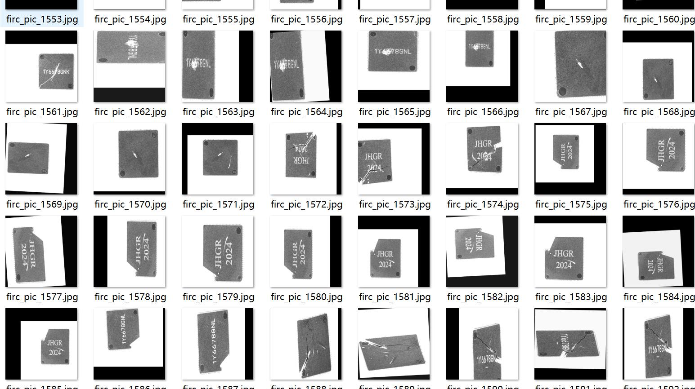
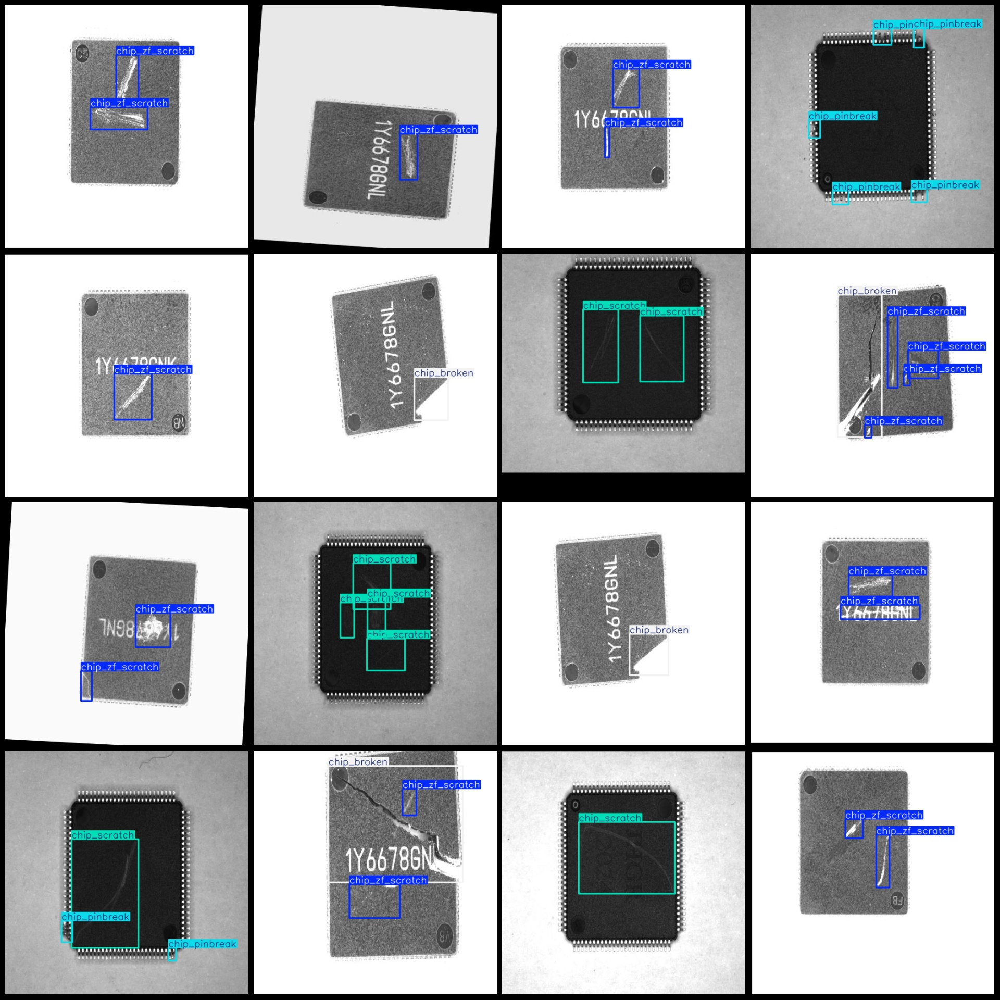
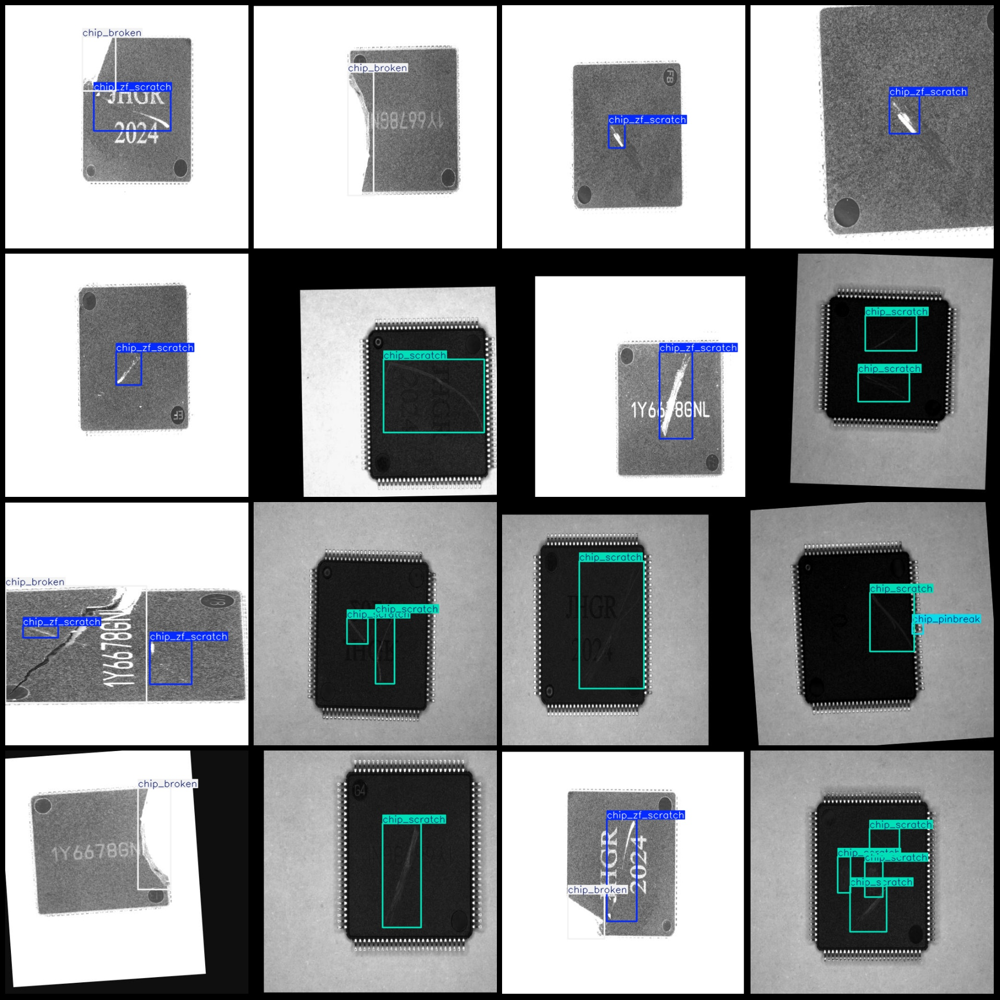

# Semiconductor Chip Scratch Marker Defects Dataset (VOC+YOLO format, 1776 images in 4 categories)

Note: The dataset contains a large number of rotated and enhanced images.

Data format: Pascal VOC format + YOLO format (txt file without split path, only containing JPG images, corresponding VOC format xml files, and yolo format txt files).

Number of images (JPG file count): 1776
Number of annotations (xml file count): 1776
Number of annotations (txt file count): 1776
Number of annotation categories: 4
Annotation category names according to the yolo format order (not the same as this one, but based on the "labels" folder's "classes.txt"): ["chip_broken", "chip_pinbreak", "chip_scratch", 
"chip_zf_scratch"]

Number of bounding boxes per category:
- chip_broken = 446
- chip_pinbreak = 816
- chip_scratch = 1323
- chip_zf_scratch = 1286
Total bounding boxes = 3871

Number of images per category:
- chip_broken = 446
- chip_pinbreak = 320
- chip_scratch = 754
- chip_zf_scratch = 732

Image resolution: 512x512

Annotation tool used: labelImg
Annotation rules: draw bounding boxes for each category

Important note: The dataset does not have been split into training, validation, or test sets; it requires self-splitting.

Special declaration: This dataset does not guarantee any accuracy for models trained or weights files.

Image preview:

Annotation examples:

## Images

Here is a pay link on Stripe ( https://buy.stripe.com/3cs8yP7sY87d0vu9AB ). Please contact me lonlonago@foxmail.com after funding $89, and I will send you a complete data files , thank you!

